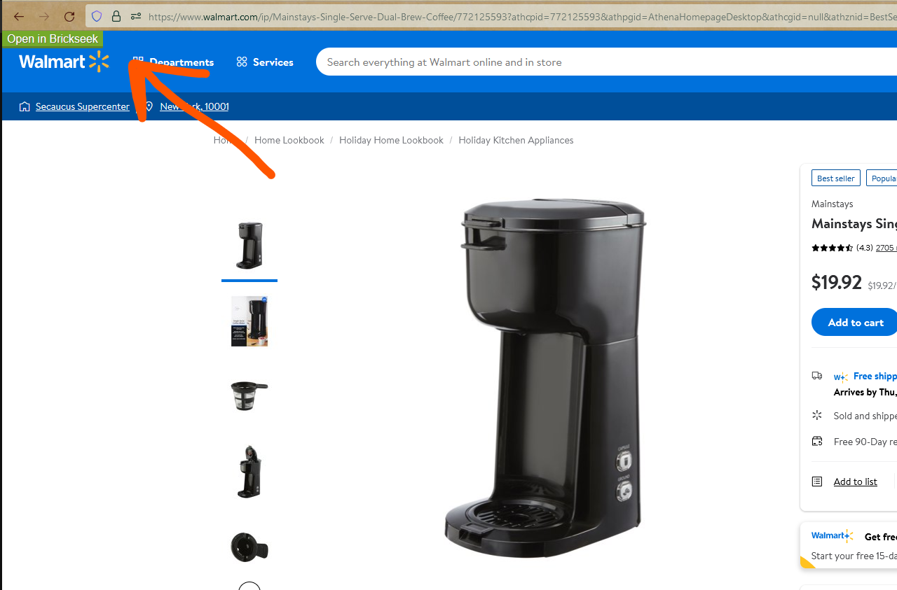

#  Brickseek

> Browser extension (Firefox & Chrome) that adds an 'Open in Brickseek' button to Walmart product pages

## Example

## Install

[link-chrome]: https://chrome.google.com/webstore/detail/panopto-downloader/eiipnolnldiglhnkfhcmmppdcfnjgdna 'Version published on Chrome Web Store'
[link-firefox]: https://addons.mozilla.org/en-US/firefox/addon/panopto-downloader/ 'Version published on Mozilla Add-ons'

[][link-chrome]  Chrome [][link-chrome] also compatible with [][link-chrome] Edge [][link-chrome] Opera

[][link-firefox] Firefox [][link-firefox]

## Developers
Go to [Development Documentation](DEVELOPMENT.md)